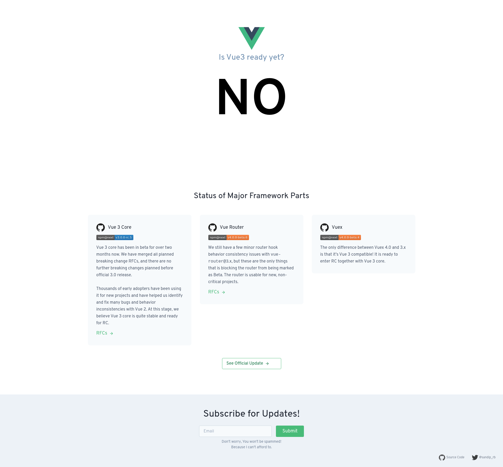
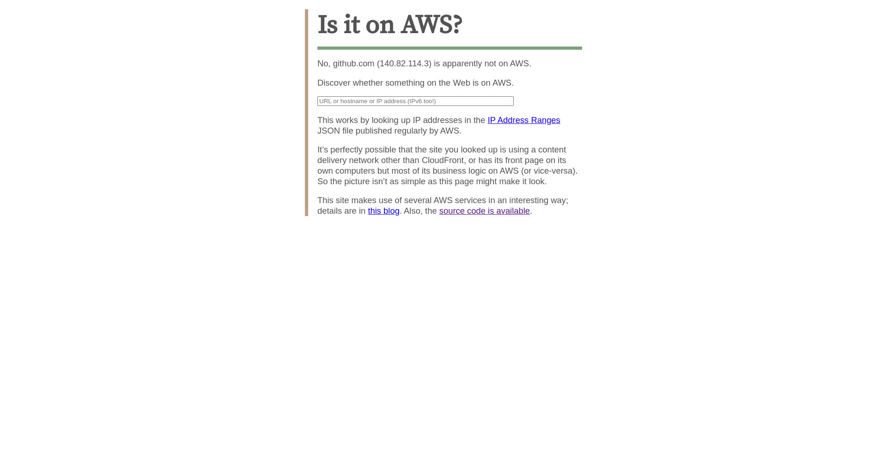
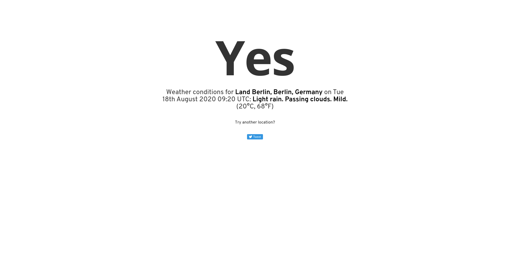

# Awesome Yes/No 

> Awesome collection of pages that answer yes or no.

<!-- START doctoc generated TOC please keep comment here to allow auto update -->
<!-- DON'T EDIT THIS SECTION, INSTEAD RE-RUN doctoc TO UPDATE -->
## Contents

- [Event based](#event-based)
- [Scenario based](#scenario-based)

<!-- END doctoc generated TOC please keep comment here to allow auto update -->

## Event based

- [isvue3readyyet.com](https://isvue3readyyet.com)
    

## Scenario based

- [isitonaws.com](https://isitonaws.com/discover?name=github.com) ([code](https://github.com/awslabs/IsItOnAWS))
    
- [isitraining.in](https://isitraining.in/berlin)
    
- [isitup.org](https://isitup.org/github.com) ([code](https://github.com/sjparkinson/isitup.org))
    
